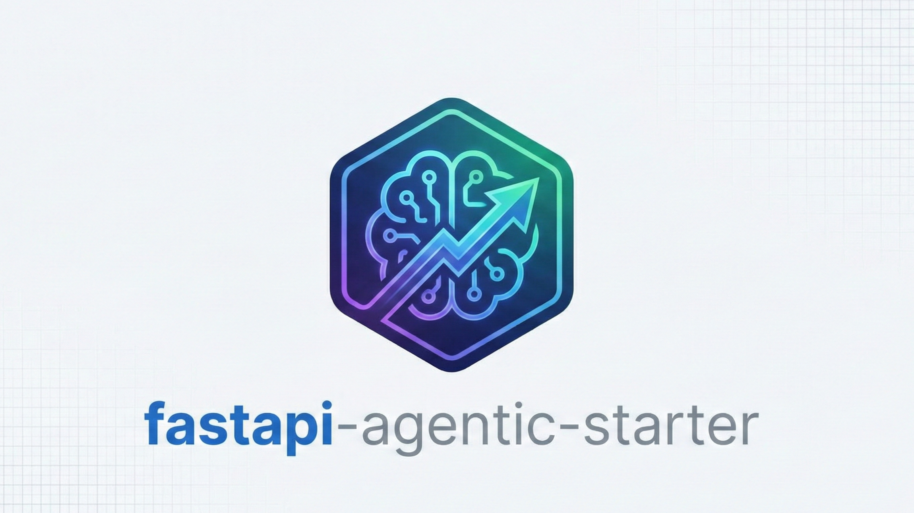

# FastAPI-Agentic-Starter
>
> **The AI-First Backend for Scalable, Intelligent Applications.**

<p align="center">
  
</p>

## Introduction

**FastAPI-Agentic-Starter** is a production-ready boilerplate designed for building robust, AI-powered backends. Built with a "AI-First" philosophy, it combines the performance of FastAPI with a modular architecture that treats LLM interactions as first-class citizens. Whether you're building autonomous agents, RAG pipelines, or intelligent APIs, this starter kit provides the scalability and clean code structure you need to move fast.

## Key Features

- 🤖 **AI-Native Architecture**: Dedicated `src/agents` layer for managing LLM logic, tools, and complex agentic workflows, keeping your AI logic distinct from standard API routes.
- 🏗️ **Hexagonal Architecture**: Clean separation of concerns with ports and adapters pattern, making your application testable and maintainable.
- 🔌 **Provider Pattern**: Cleanly separate external services with `src/providers`. Easily swap or upgrade integrations for OpenAI, Redis, or VectorDBs without tangling your business logic.
- 🧠 **Business Logic Separation**: Clear distinction between `usecases` and `actions` within `src/execution`, ensuring your core application logic remains testable and maintainable.
- 💾 **Database Abstraction**: Robust Repository pattern implementation in `src/database` for flexible data access and management.
- ⚡ **Async-Ready & High Performance**: Built on **FastAPI**, fully leveraging Python's async capabilities for high-throughput, low-latency applications.

## FastAPI Hexagonal Agentic Structure

A hybrid architecture combining Layered & Hexagonal concepts for maximum flexibility.

```text
src/
├── api/                    # Interface Layer - FastAPI application code
│   ├── endpoints/          # API endpoint definitions (grouped by version)
│   │   └── v1/             # Version 1 endpoints with its own dependencies.py
│   ├── middlewares/        # Global middlewares (logging, error handling)
│   └── router/             # Router aggregation and version prefix management
├── execution/              # Application Layer - Business logic (equivalent to services)
│   ├── usecases/           # Use case code for executing actions
│   └── actions/            # Action code implementations
├── core/                   # Shared Core Layer - Exceptions, base models
├── agents/                 # AI Agent Management
│   ├── agent_manager/      # Agent definitions
│   ├── prompts/            # Agent prompts
│   ├── tools/              # Agent tools
│   └── workflows/          # Agent workflows
├── providers/              # Infrastructure Layer - External service providers
├── database/               # Database Layer
│   ├── repositories/       # Data repositories
├── config/                 # Configuration files
└── tests/                  # Automated Tests
```

## Architecture Flow

```
Request → API Endpoints → Use Cases → Actions → Agents → Response
```

1. **API Layer** (`src/api/`): Handles HTTP requests and responses
2. **Execution Layer** (`src/execution/`): Contains business logic and orchestrates actions
3. **Agent Layer** (`src/agents/`): Manages AI agents and their interactions
4. **Provider Layer** (`src/providers/`): Integrates with external services

## Tech Stack

- **Framework**: [FastAPI](https://fastapi.tiangolo.com/)
- **AI/LLM Orchestration**: [LangChain](https://www.langchain.com/) + [LangGraph](https://langchain-ai.github.io/langgraph/)
- **Database**: PostgreSQL
- **Caching & Queues**: [Redis](https://redis.io/)
- **Validation**: [Pydantic](https://docs.pydantic.dev/)
- **Package Manager**: [uv](https://docs.astral.sh/uv/)

## Getting Started

Follow these steps to get your AI backend up and running.

1. **Clone the Repository**

    ```bash
    git clone https://github.com/KJ-AIML/fastapi-agentic-starter.git
    cd fastapi-agentic-starter
    ```

2. **Configure Environment**
    Copy the example environment file and configure your secrets.

    ```bash
    cp .env.example .env
    ```

3. **Install Dependencies**
    Using `uv` (recommended):

    ```bash
    uv sync
    ```

4. **Run the Application**
    Start the development server with hot-reloading.

    ```bash
    uv run -m src.api.main
    ```

    Access the API documentation (powered by **Scalar**) at `http://localhost:3000/docs`.

## Development Commands

```bash
# Run the application
uv run -m src.api.main

# Run tests
uv run pytest src/tests

# Run utility functions
uv run -m src.utils.helpers

# Add new dependencies
uv add <package-name>

# Sync dependencies
uv sync
```

## Project Structure Guidelines

This project follows the [FastAPI Hexagonal Agentic Structure] with specific conventions:

- **API Layer**: Routes, endpoints, and version-specific dependency injection (each version has its own dependencies.py)
- **Execution Layer**: Business logic (usecases and actions)
- **Agent Layer**: AI agent management and orchestration
- **Provider Layer**: External service integrations
- **Database Layer**: Data persistence and repositories

## Contributing

1. Follow the existing code style and naming conventions
2. Add tests for new features
3. Update documentation as needed
4. Ensure all tests pass before submitting

---

*Built for the next generation of AI applications.*
